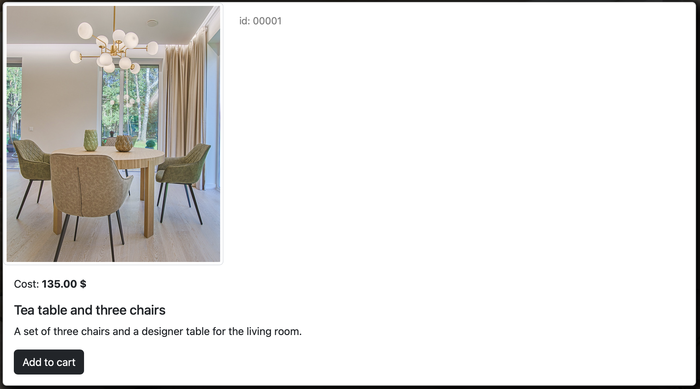
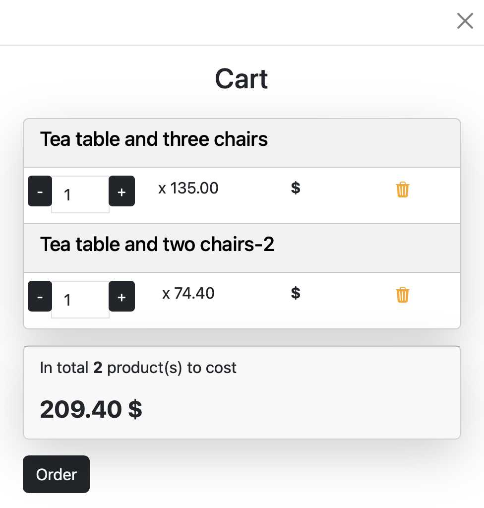
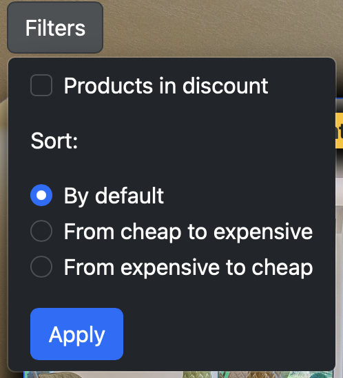
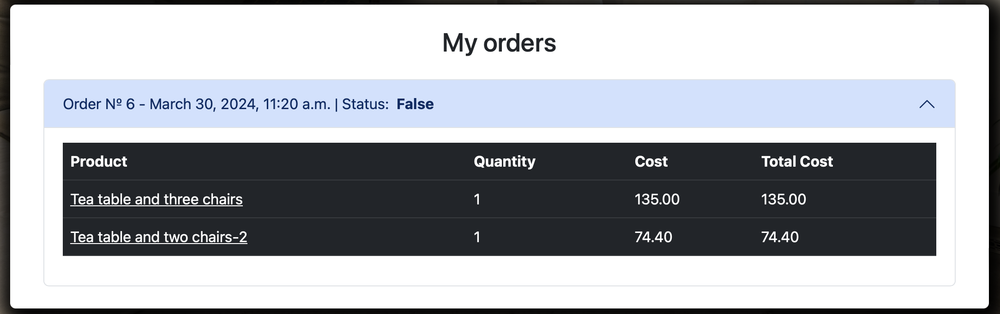
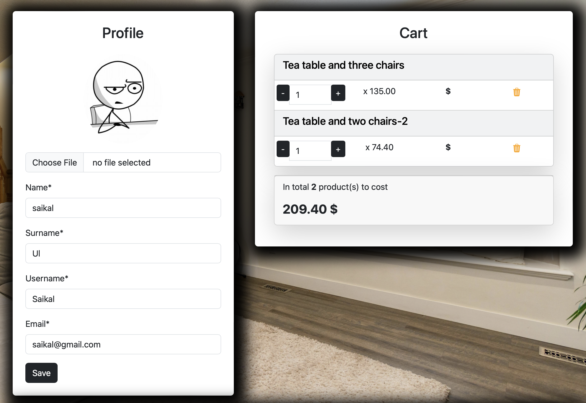

# FurniStore Online Store Website

The Online Store Website is a dynamic e-commerce platform powered by Python Django REST framework. Leveraging HTML, CSS, Bootstrap, and JavaScript with AJAX, it provides users with an immersive shopping experience. Supported by a PostgreSQL database, the platform ensures seamless transactions and effective product inventory management. 

## Features

- **Product Categories**: The website offers a variety of product categories for users to explore.
- **Product Listings**: Users can view detailed listings for each product, including descriptions, prices, and images.
- **Shopping Cart**: Users can add products to their shopping cart and proceed to checkout to place orders.
- **Search Functionality**: Users can search for products based on keywords or categories.
- **Filtering**: Users can filter products by cost to find items within their budget.
- **User Authentication**: Users can register and log in to the website to access personalized features.
- **User Profile:** Every logged-in user has a profile where they can track their cart and orders.
- **Seller Features**: Users can also register as sellers and list their own products for sale.
- **Admin Dashboard**: Administrators have access to a dashboard to manage users, products, and orders.
- **Pagination**: Product listings are paginated for easy navigation.

    <h3>All products</h3>
    
    <h3>Product's description</h3>
    
    

        <h3>Cart</h3>
        
    

    

        <h3>Filter</h3>
        
    

    <h3>Orders</h3>
    
    <h3>User's profile</h3>
    

## Installation

1. Clone the repository:
    git clone https://github.com/saikaldi/FurnitureStore

2. Install dependencies:
    pip install -r requirements.txt

3. Set up the PostgreSQL database and configure the database settings in `settings.py`.
4. Apply migrations:
    python manage.py migrate

5. Run the development server: python manage.py runserver
6. Access the website at `http://localhost:8000/`.

## Contributing

Contributions are welcome! If you'd like to contribute to this project, please follow these steps:

1. Fork the repository.
2. Create your feature branch (`git checkout -b feature/my-feature`).
3. Commit your changes (`git commit -am 'Add some feature'`).
4. Push to the branch (`git push origin feature/my-feature`).
5. Create a new Pull Request.
